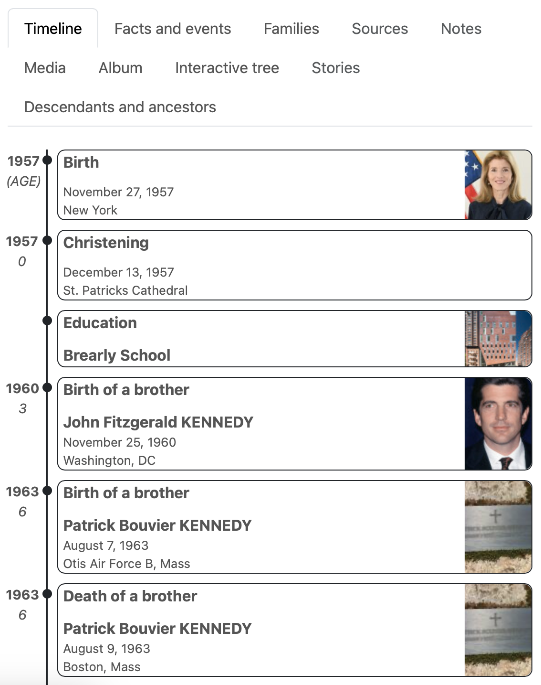
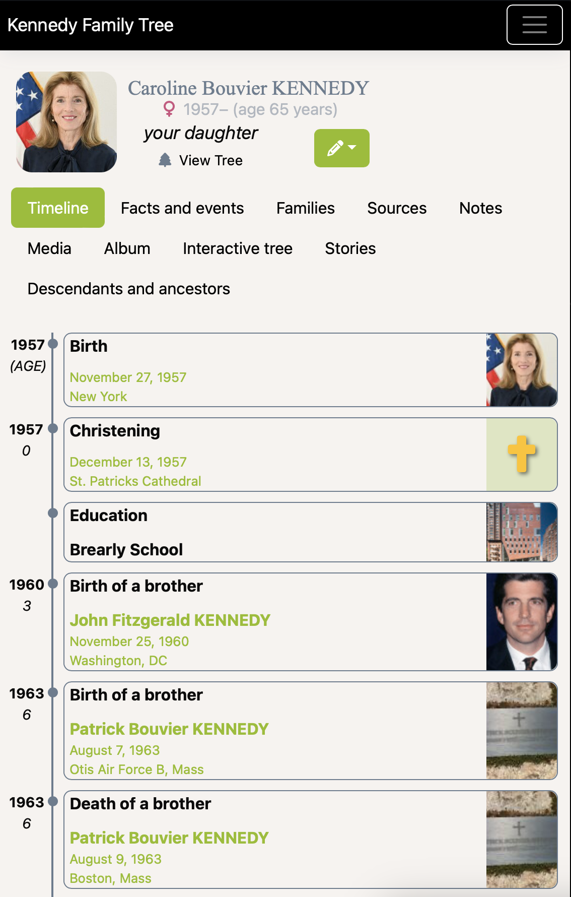

# Timeline
This custom webtrees module adds tab for each individual displaying a timeline view similar to Ancestry or FamilySearch.

Compatibility: Webtrees 2.1.16

## Features

* Clean, simple timeline view
* Displays fact images (theme/css dependent))
* Include/exclude types of facts in the module's settings

<table>
<tr><td>Webtrees Theme</td><td><a href="https://github.com/JesseWebDotCom/webtrees-theme-modern">Modern theme</a></td></tr>
<tr><td></td><td></td></tr>
</table>

## Installation

Install and enable the module:
* Download and unzip the release package.
* Place the webtrees-tab-timeline folder inside modules_v4 folder of your webtrees installation.
* Open the control panel, Modules | Tabs, check "enabled" next to the Timeline module, click "Save"

Note: Here you can also change the access level (recommended: Show to visitors) and order (recommended as the first tab to display)

## Upgrading
To upgrade an existing installation of the module, simply replace the webtrees-tab-timeline folder inside the modules_v4 folder with the new one.

## Customization

You can change additional settings like which facts to display:
* Open the control panel, Modules | Tabs
* Click the prefererences icon next to the "Timeline" module
* Change your desired settings and save.